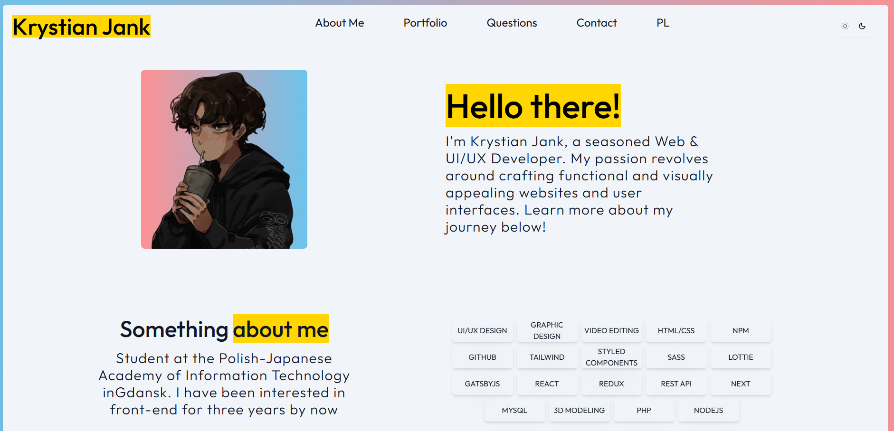
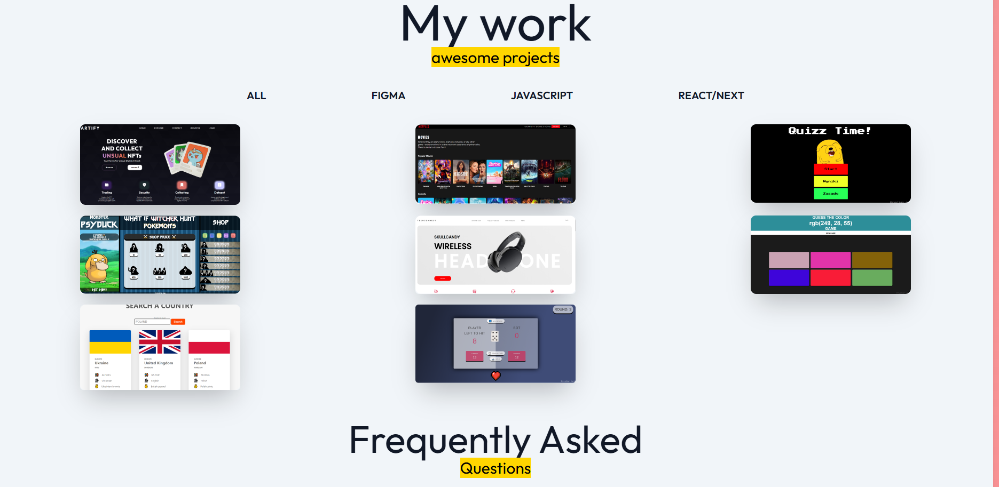
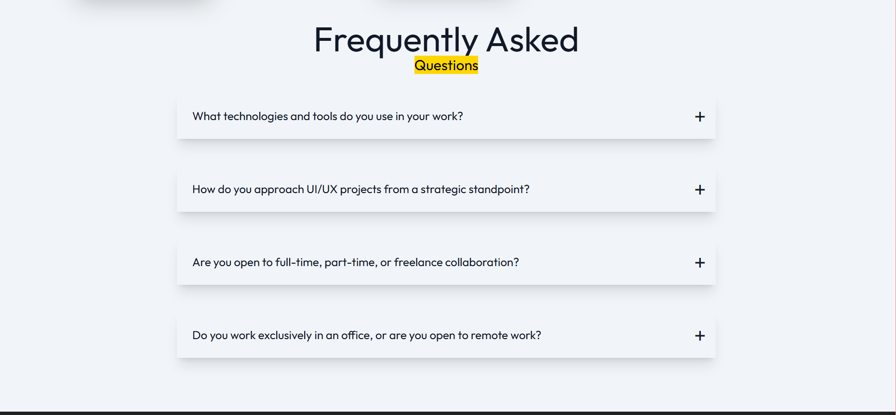
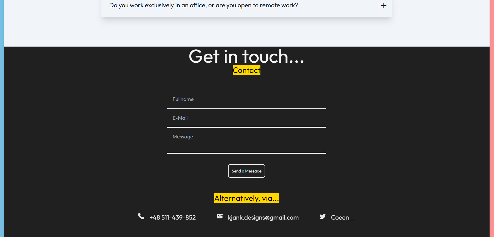
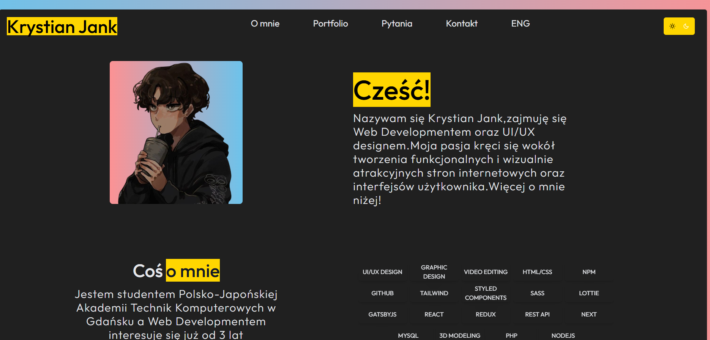

# Portfolio Website

This is my personal **portfolio website**, built with **React** and styled with **Tailwind CSS**.  
It served as my first professional showcase and likely helped me land my first job as a Frontend Developer.
> **Note:** This portfolio is fully reusable and can be adapted as your own with modifications.  
> If you want a link to the Figma UI design, please contact me via email.


## Features

- Fully responsive and interactive design.  
- Built with **React** for a maintainable and scalable frontend.  
- Styled entirely with **Tailwind CSS** for clean, modern design.  
- UI and layouts were **designed in Figma**.  
- Visitors can **contact me directly** via email.  
- Includes **screenshots and project previews** hosted on Netlify.  
- Hosted on a custom server for the main portfolio site.

## Tech Stack

- **Frontend:** React  
- **Styling:** Tailwind CSS  
- **Deployment:** Custom server (portfolio site), Netlify (project links)

## Usage

```bash
git clone <repo-url>
cd <project-folder>
npm install
npm start
```

## Screenshots

<div style="display: flex; gap: 10px; flex-wrap: wrap;">
  
  
  
  
  
</div>
